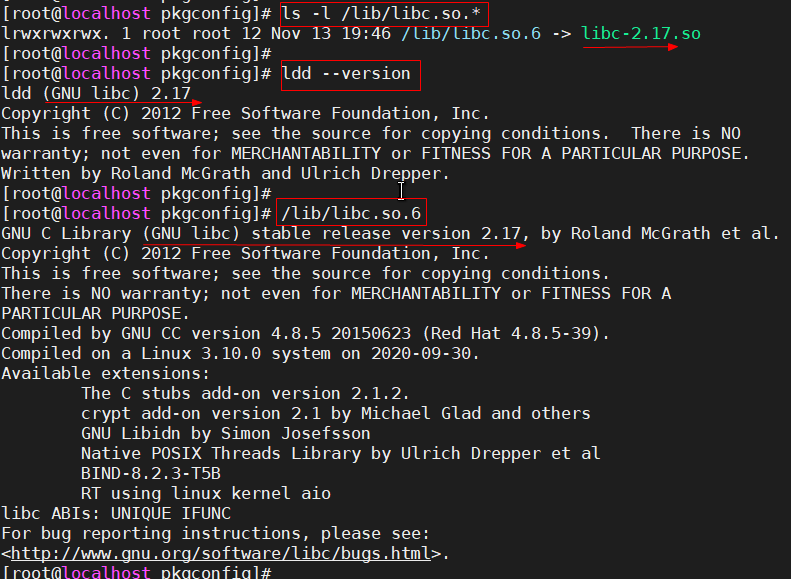
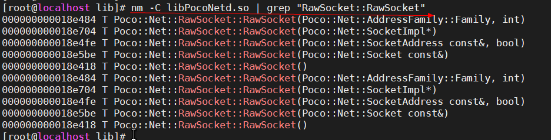

##### 如何查看glibc版本

```
方式一:  ls -l /lib/libc.so.*
方式二:  ldd --version
方式三:  /lib/libc.so.6
```



-----------------------------------------

##### 如何查看函数符号表

```
nm -C libPocoNetd.so | grep "RawSocket::RawSocket"
```



-----------------------


