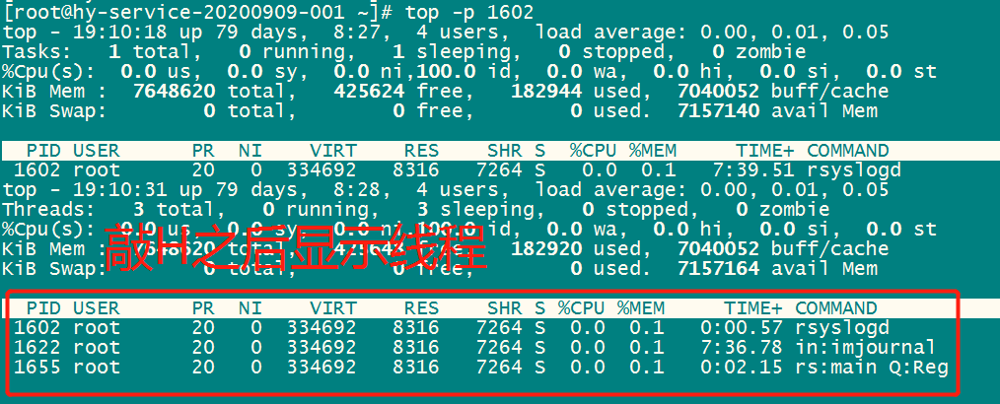

##### 如何查看glibc版本

```shell
方式一:  ls -l /lib/libc.so.*
方式二:  ldd --version
方式三:  /lib/libc.so.6
```


-----------------------------------------

##### 如何查看函数符号表

```shell
nm -C libPocoNetd.so | grep "RawSocket::RawSocket"
```


-----------------------

##### systemctl 使用总结

```shell
systemctl enable mysqld    #配置开机启动
systemctl disable mysqld   #取消开机启动

systemctl start mysqld     #启动mysql服务
systemctl stop  mysqld     #停止mysql服务

systemctl status mysqld            #查看mysql服务状态
systemctl status mysqld.service    #查看mysql服务状态
```

-------------------------------------------

##### SeLinux 操作说明

```shell
setenforce 0       #临时关闭SeLinux
sestatus           #查看SeLinux状态
vi /etc/selinux/config，将SELINU置为disabled    #永久关闭SeLinux，需要重启机器 
```

-----------------------------

##### linux 防火墙操作说明

```shell
systemctl stop firewalld.service       #停止防火墙服务，临时
systemctl disable firewalld.service    #防火墙开机不启用
```

------------------------------

##### 添加smb服务到防火墙

```shell
firewall-cmd --add-service samba --permanent  #永久添加samba服务到防火墙策略中
firewall-cmd --reload                         #重启防火墙
firewall-cmd --list-all|grep samba            #查看samba服务是否添加到防火墙中
```

---------------------

##### 查看目录文件大小

```shell
du -h -d 1
```

-----------------

##### rsync使用说明

```shell
Local to Local:  rsync [OPTION]... SRC [SRC]... DEST
Local to Remote: rsync [OPTION]... SRC [SRC]... [USER@]HOST:DEST
Remote to Local: rsync [OPTION]... [USER@]HOST:SRC [DEST]
```

```shell
rsync -auzPv --delete --exclude "poco/.git/*" -e "ssh -p 51212 -i /drives/d/rsa_key" /drives/d/code/poco root@xx.xx.xx.xx:/appdata/code

#-a  --archive表示存档模式，保存所有的元数据，比如修改时间（modification time）、权限、所有者等，并且软链接也会同步过去。
#-u  --update参数表示同步时跳过目标目录中修改时间更新的文件，即不同步这些有更新的时间戳的文件。
#-z  参数指定同步时压缩数据。
#-P  -P参数是--progress和--partial这两个参数的结合。--partial参数允许恢复中断的传输。--progress参数表示显示进展。
#-v  参数表示输出细节。

#--delete  此参数删除只存在于目标目录、不存在于源目标的文件，即保证目标目录是源目标的镜像。
#--exclude 同步时排除某些文件或目录

#-e 指定使用 SSH 协议传输数据。
#-p 51212 指定SSH端口
#-i 指定秘钥
```

参考链接：  https://www.ruanyifeng.com/blog/2020/08/rsync.html

-------------------------

##### 显示某个进程的线程

```shell
top -p 7874   查看某个进程
H 查看线程
```



-------------------------
##### 通过locate查找某个文件
```shell
[root@localhost build]# locate libcrypto.so
/usr/lib64/.libcrypto.so.0.9.8e.hmac
/usr/lib64/.libcrypto.so.1.0.2k.hmac
/usr/lib64/.libcrypto.so.10.hmac
/usr/lib64/.libcrypto.so.6.hmac
/usr/lib64/libcrypto.so
/usr/lib64/libcrypto.so.0.9.8e
/usr/lib64/libcrypto.so.1.0.2k
/usr/lib64/libcrypto.so.10
/usr/lib64/libcrypto.so.6
```

##### 查看linux系统版本

```shell
uname -a
cat /proc/version
cat /etc/redhat-release  ## centos系统还可以通过此命令查看
```

