#### 参考链接

https://www.cnblogs.com/colos/category/1489517.html


【未学习】iptables详解（14）：iptables小结之常用套路
【未学习】iptables详解（13）：iptables动作总结之二
【未学习】iptables详解（12）：iptables动作总结之一
【未学习】iptables详解（11）：iptables之网络防火墙
【未学习】iptables详解（10）：iptables自定义链
【未学习】iptables详解（9）：iptables的黑白名单机制
【未学习】iptables详解（8）：iptables扩展模块之state扩展
【未学习】iptables详解（7）：iptables扩展之udp扩展与icmp扩展
【未学习】iptables详解（6）：iptables扩展匹配条件之’–tcp-flags’
【未学习】iptables详解（5）：iptables匹配条件总结之二（常用扩展模块）
【未学习】iptables详解（4）：iptables匹配条件总结之一
【已学习】iptables详解（3）：iptables规则管理
【已学习】iptables详解（2）：iptables实际操作之规则查询
【已学习】iptables详解（1）：iptables概念


---------------------------------

#### 数据经过防火墙的流程

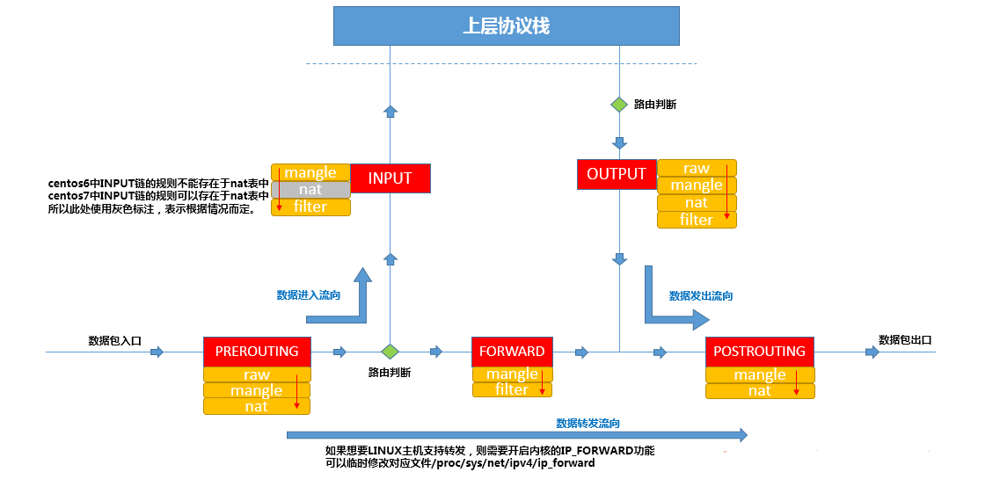

--------------------------------------------------

#### 表名：raw表、mangle表、nat表、filter表

#### 链名：PREROUTING链、INPUT链、OUTPUT链、POSTROUTING链、FORWARD链

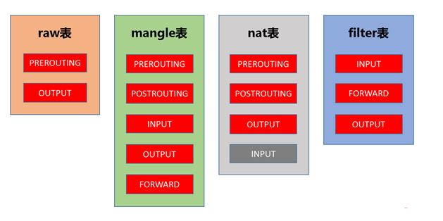

#### 说明：

- INPUT链的默认策略是ACCEPT，也就是说，INPUT链默认"放行"所有发往本机的报文。当没有任何规则时，会接受所有报文；当报文没有被任何规则匹配到时，也会默认放行报文。
- 如果报文已经被前面的规则匹配到，iptables则会对报文执行对应的动作，即使后面的规则也能匹配到当前报文，也没有机会再对报文执行相应的动作了。
- 

--------------------------------

#### iptables 查规则

```
iptables -t 表名 -L 链名
iptables -t filter -L INPUT
```

```
表名包括：raw表、mangle表、nat表、filter表。
链名包括：PREROUTING链、INPUT链、OUTPUT链、POSTROUTING链、FORWARD链。
-t选项，查看对应的表；当没有使用-t选项指定表时，默认为操作filter表。
-L选项，表示列出规则，即查看规则。
```

#### 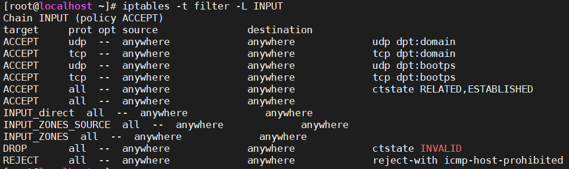 

------------------------------------

```
iptables -t nat -L PREROUTING -v -n --line
iptables -t filter -L INPUT -nv --line-num
```

```
-v选项，verbose，查看更多的、更详细的信息，可以显示"计数器"(packets与bytes)信息。
-x选项，表示显示精确的计数值，而不是经过可读性优化过的计数值。
-n选项，表示不解析IP地址。
--line选项，显示规则的序号。
```

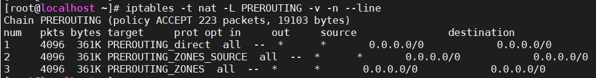

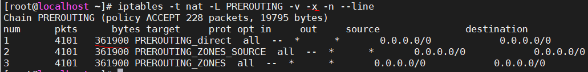

-----------------------------

#### iptables 增删规则

```
iptables -t filter -L INPUT -nv --line-num        查
iptables -t filter -I INPUT 1 -p icmp -j DROP     增
命令语法：iptables -t 表名 -P 链名 动作
iptables -t filter -D INPUT 1                     删
```

```
-I选项，insert，指明将某规则插入到某个链中，-I INPUT 1表示将新增的规则插入到INPUT链中(且其序号为1)。
-p选项，
-j选项，指明当"匹配条件"被满足时，所对应的动作；上例中指定的动作为DROP，表明报文会被DROP（丢弃）。
-D选项，表示删除指定链中的某条规则，-D INPUT 1表示删除INPUT链中的第1条规则。
```

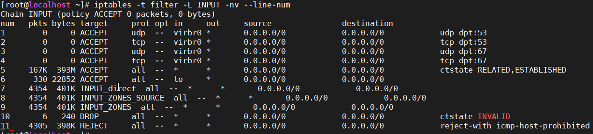

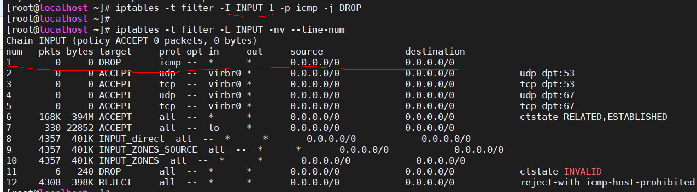

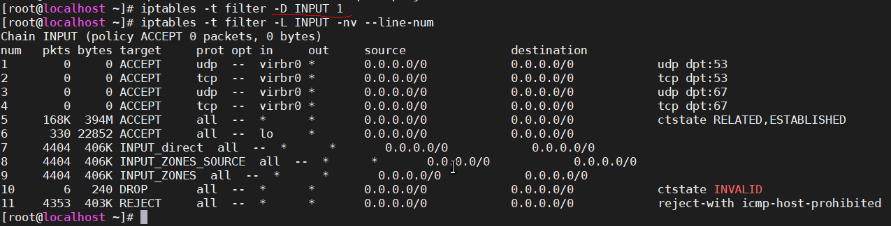

--------------------------

```
命令语法：iptables -t 表名 -F 链名
iptables -t filter -F INPUT
```

```
-F选项，表示清空对应链中的规则，执行时需三思，会删除指定表的指定链中的所有规则。
```

---------------

```
iptables -t filter -L INPUT -nv --line-num                       查
iptables -t 表名 -A 链名 匹配条件 -j 动作 
iptables -t filter -A INPUT -s 192.168.1.146 -j DROP             增
iptables -t 表名 -I 链名 规则序号 匹配条件 -j 动作
iptables -t filter -I INPUT -s 192.168.1.146 -j ACCEPT           增
```

```
-A选项，表示在对应链的末尾添加规则。
-I选型，表示在对应链的开头添加规则。
```

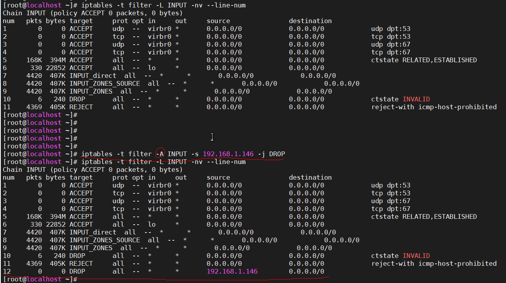

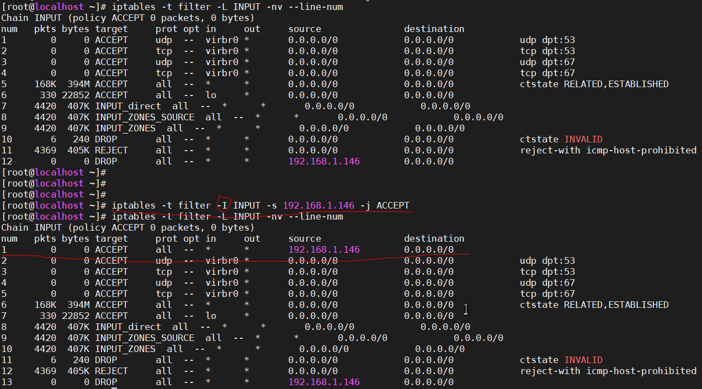

---------------------------------------

#### iptables 修改规则

```
iptables -t filter -I INPUT -s 192.168.1.146 -j ACCEPT     增
iptables -t 表名 -R 链名 规则序号 规则原本的匹配条件 -j 动作
iptables -t filter -R INPUT 1 -s 192.168.1.146 -j REJECT   改
```

```
-R选项，表示修改指定的链，但是在使用-R选项修改某个规则时，必须指定规则对应的原本的匹配条件。
PS:-R有坑，慎用，如果你想要修改某条规则，建议先将这条规则删除，然后在同样位置再插入一条新规则即可。
PS:如果上例中没有使用-s 192.168.1.146指定源地址，那么在修改后，规则中的源地址会自动变为0.0.0.0/0。
```

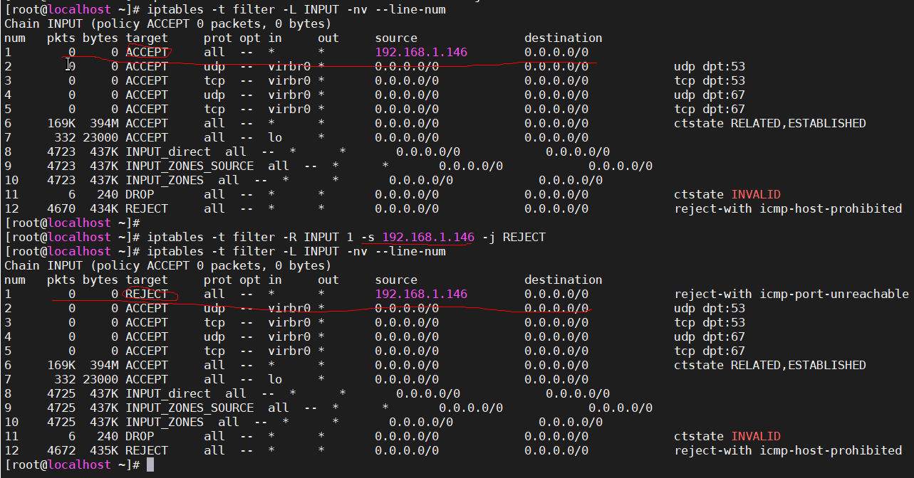

----------------------------

```
命令语法：iptables -t 表名 -P 链名 动作
iptables -t filter -P FORWARD DROP
```

```
-P选项，指定要修改的链，下例中-P FORWARD DROP表示将表中FORWRD链的默认策略改为DROP。
PS:当报文没有被链中的任何规则匹配到时，防火墙会按照默认动作处理报文(即链的默认策略)
```

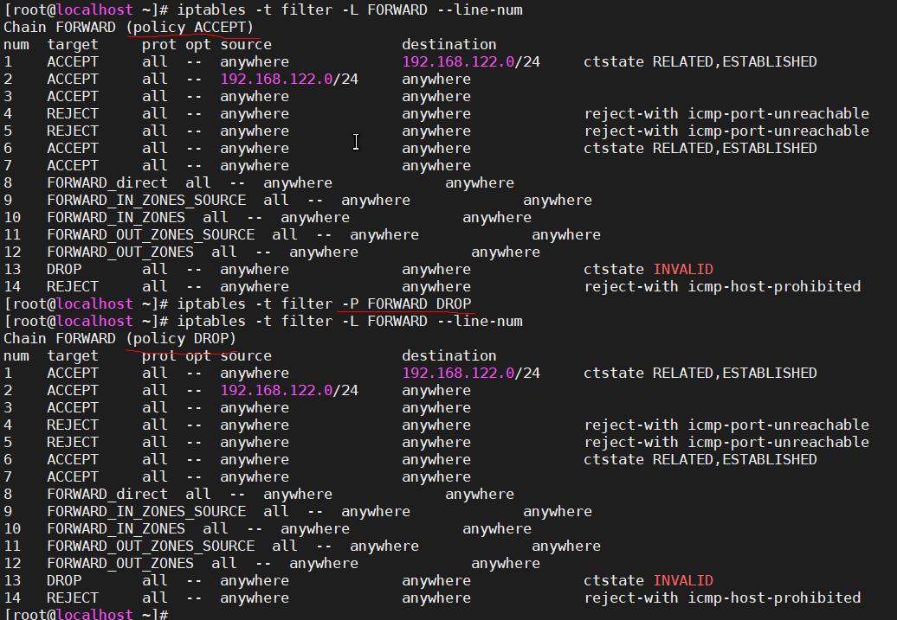

#### iptables 保存规则

```
#配置好yum源以后安装iptables-service
yum install -y iptables-services
#停止firewalld
systemctl stop firewalld
#禁止firewalld自动启动
systemctl disable firewalld
#启动iptables
systemctl start iptables
#将iptables设置为开机自动启动，以后即可通过iptables-service控制iptables服务
systemctl enable iptables

上述配置过程只需一次，以后即可在centos7中愉快的使用service iptables save命令保存iptables规则了.
PS:未实际尝试
```


