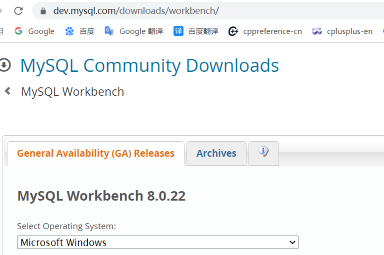
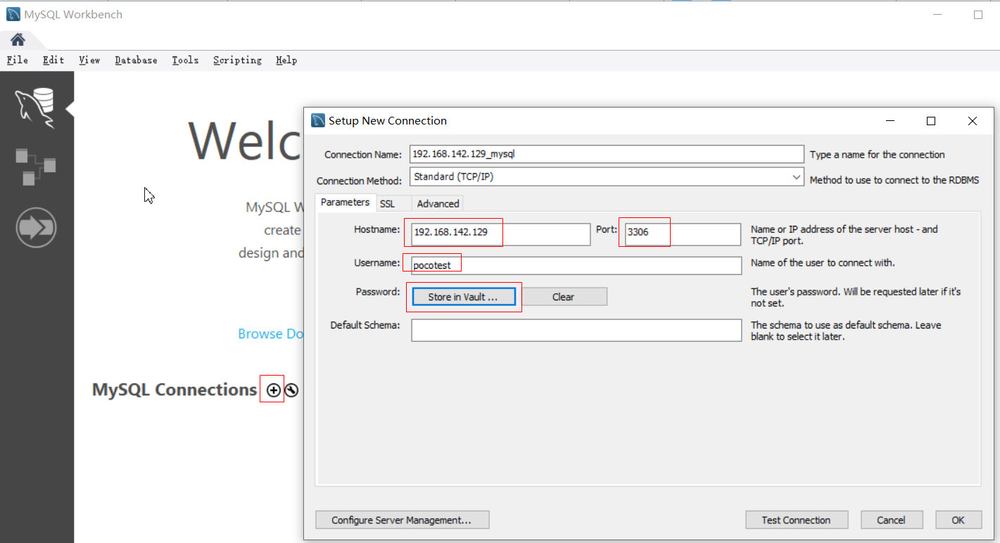
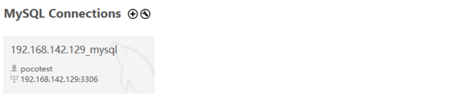
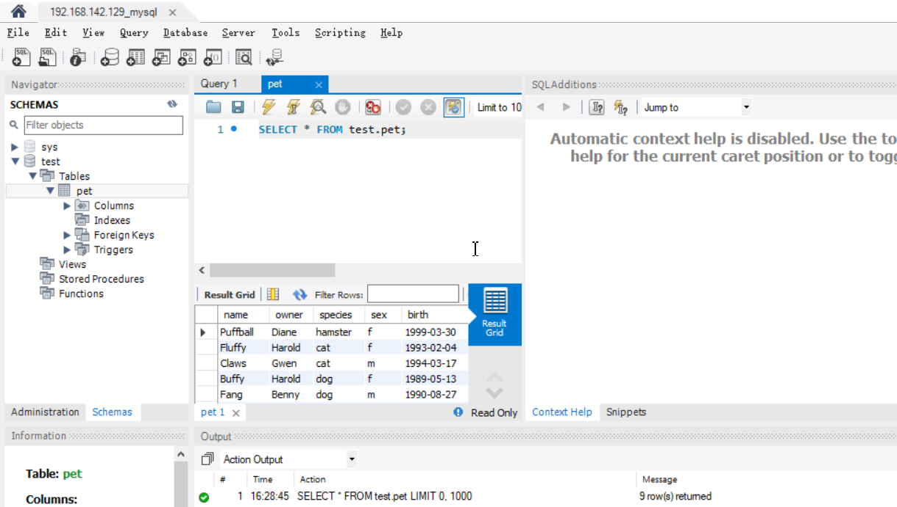

#### 1、mysql客户端

##### 1.1 创建远程mysql用户

```
mysql -uroot -proot
mysql> create user pocotest@'%' identified by 'pocotest';
#用户pocotest
#密码pocotest
#'%'表示所有地址均可登入
```

##### 1.2 授权

```
mysql> grant all on *.* to pocotest@'%' identified by 'pocotest' with grant option;
```

##### 1.3 打开防火墙端口

```
firewall-cmd --zone=public --add-port=3306/tcp
```

#### 2、mysql客户端

##### 2.1 Windows客户端安装

```
从官网下载MySQL Workbench，直接双击安装即可
```

https://dev.mysql.com/downloads/workbench/



##### 2.2 创建客户端连接



##### 2.3 双击即可操作



