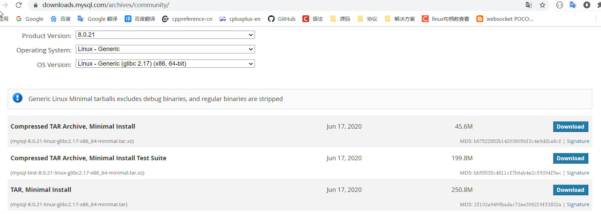
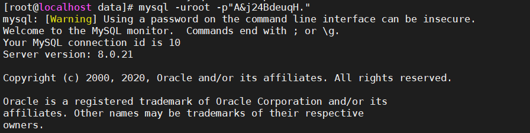
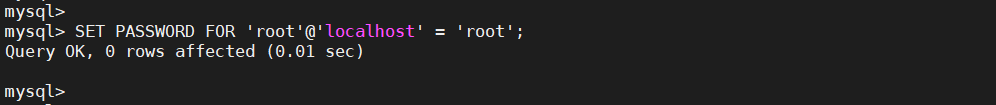

#### centos7 安装 mysql-8.0 过程 

```
0、清理历史环境
rpm -qa | grep mariadb
yum remove mariadb-libs -y
```

```
1、从官网下载mysql社区版本，并解压到/usr/local目录
cd /usr/local
tar zxvf mysql-8.0.21-linux-glibc2.17-x86_64-minimal.tar
tar -xvf mysql-8.0.21-linux-glibc2.17-x86_64-minimal.tar.xz
tar -xvf mysql-test-8.0.21-linux-glibc2.17-x86_64-minimal.tar.xz
ln -s mysql-8.0.21-linux-glibc2.17-x86_64-minimal/ mysql
```

https://downloads.mysql.com/archives/community/



```
2、设置环境变量
在 vi /etc/profile 中添加如下命令，并运行 source /etc/profile 使之生效 
export PATH=$PATH:/usr/local/mysql/bin
export C_INCLUDE_PATH=$C_INCLUDE_PATH:/usr/local/mysql/include
export CPLUS_INCLUDE_PATH=$CPLUS_INCLUDE_PATH:/usr/local/mysql/include
export LD_LIBRARY_PATH=$LD_LIBRARY_PATH:/usr/local/mysql/lib
export LIBRARY_PATH=$LIBRARY_PATH:/usr/local/mysql/lib
export PKG_CONFIG_PATH=$PKG_CONFIG_PATH:/usr/local/mysql/lib/pkgconfig
```

```
3、创建mysql用户和组
groupadd mysql
useradd -r -g mysql -s /bin/false mysql
```

```
4、设置数据目录权限
mkdir -p /data/mysql_data
chown mysql:mysql /data/mysql_data
chmod 750 /data/mysql_data
```

```
5、初始化
mysqld --initialize --user=mysql --basedir=/usr/local/mysql --datadir=/data/mysql_data
# "root@localhost: F=<gKOpd2SKm" 记录此生成的初始密码，后续步骤需使用此来更改root用户密码
```

```
6、书写默认配置文件 
vim /etc/my.cnf
[client]
port = 3306
socket = /tmp/mysql.sock

[mysqld]
user=mysql
basedir=/usr/local/mysql
datadir=/data/mysql_data
server_id=1
port=3306
socket=/tmp/mysql.sock
```

```
7、准备配置启动脚本
cp /usr/local/mysql/support-files/mysql.server /etc/init.d/mysqld

systemctl enable mysqld   #centos7中启动命令，将其添加到systemctl的
systemctl start  mysqld
```

```
8、更改root@localhost密码
mysql -uroot -p                 #此处输入之前生成的初始密码 F=<gKOpd2SKm
mysql -uroot -p"F=<gKOpd2SKm"   #此处输入之前生成的初始密码 F=<gKOpd2SKm
SET PASSWORD FOR 'root'@'localhost' = 'root';
```





```
9、创建远程用户
create user pocotest@'%' identified by 'pocotest';
grant all on *.* to pocotest@'%';
```

```
10、打开防火墙端口
firewall-cmd --zone=public --add-port=3306/tcp
```


参考链接：

linux环境变量设置： https://www.jianshu.com/p/d1e3fa6dbd7c

官网二进制包安装：https://dev.mysql.com/doc/refman/5.7/en/binary-installation.html

